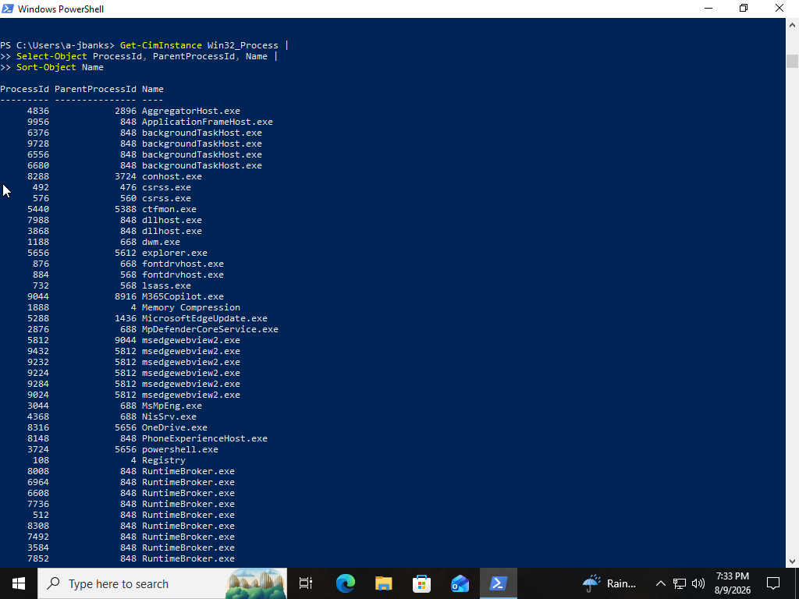
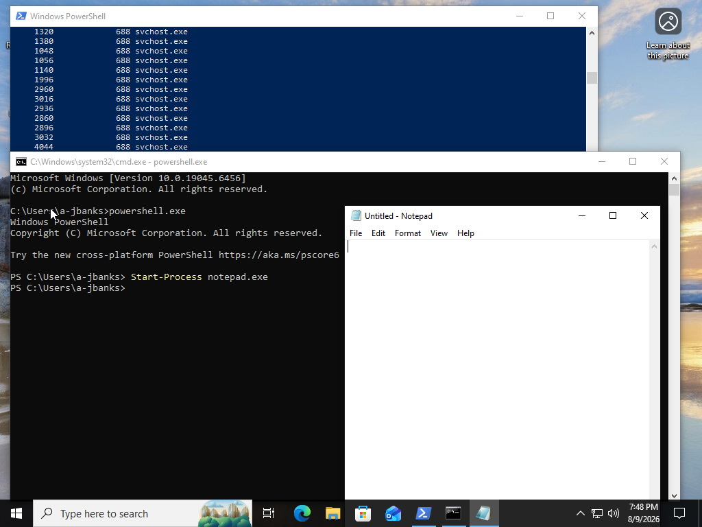
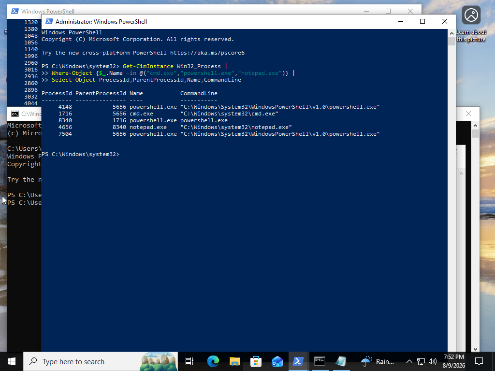
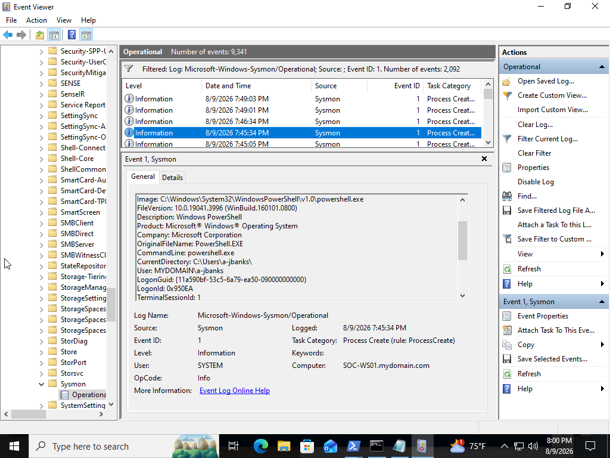
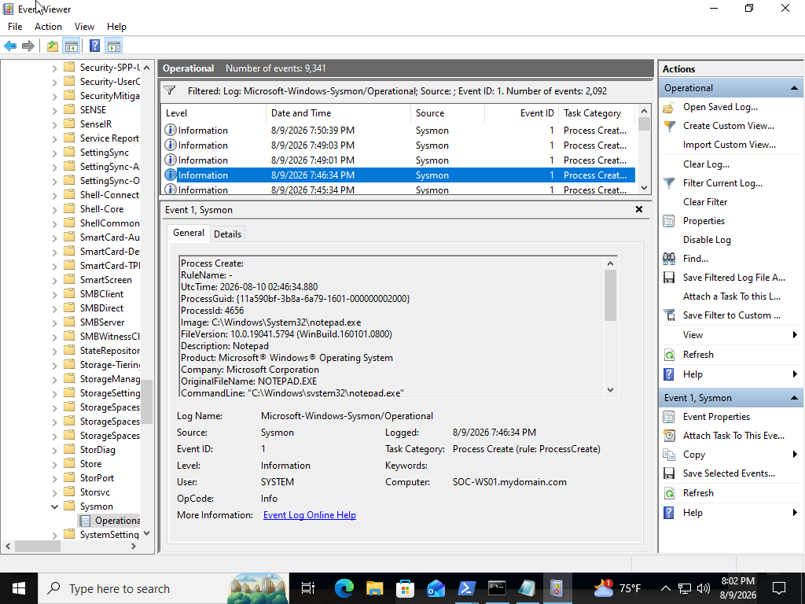
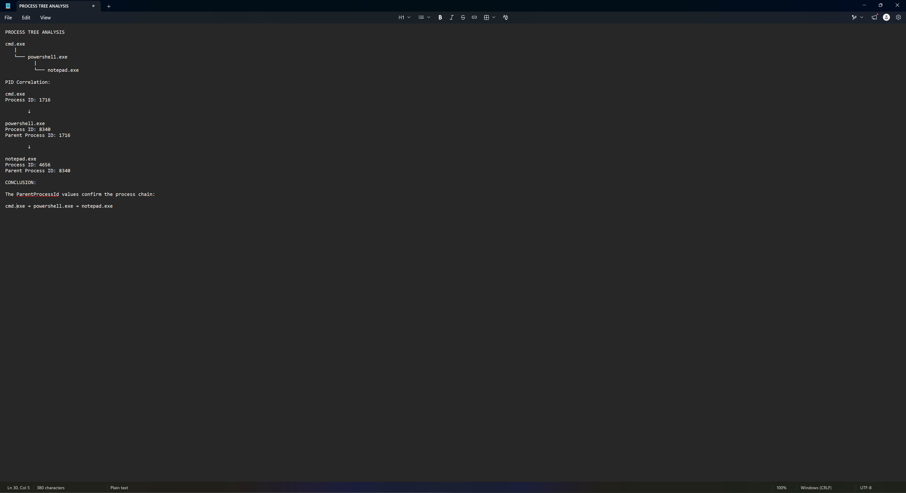
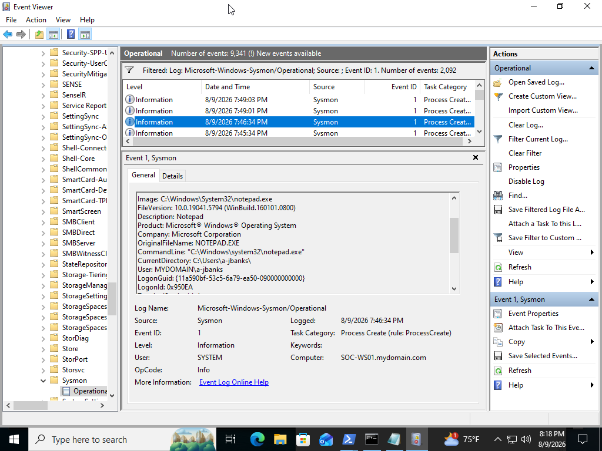
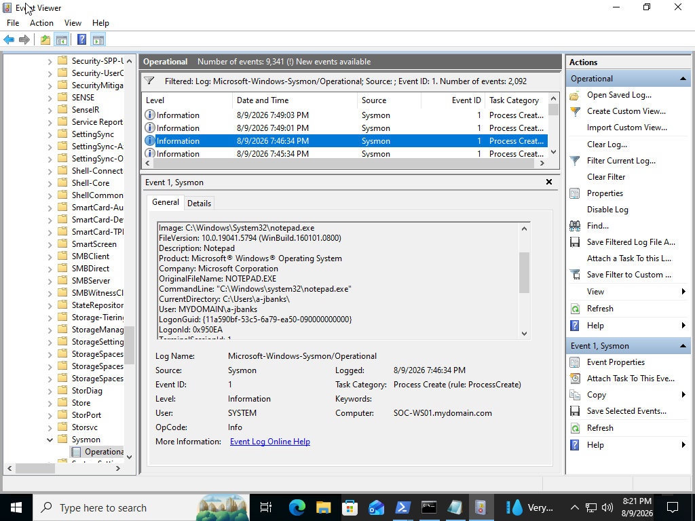

# SOC Analyst Lab #9 - Process Tree & Parent/Child Analysis

## Project Overview

This project demonstrates how Windows process execution can be investigated by analyzing parent and child process relationships.

The lab focused on generating a controlled process chain, identifying process and parent process IDs, analyzing Sysmon process creation telemetry, reconstructing the execution chain, and determining whether the observed activity was consistent with legitimate user behavior.

Parent/child process relationships provide important context during security investigations because legitimate applications can become suspicious when launched by unexpected processes or with unusual command-line arguments.

---

## Objectives

- Enumerate Windows processes
- Identify Process IDs and Parent Process IDs
- Generate a controlled process chain
- Analyze Sysmon Event ID 1
- Investigate parent/child process relationships
- Analyze PowerShell command-line activity
- Reconstruct a process tree
- Evaluate process execution context
- Document findings from a SOC analyst perspective

---

## Lab Environment

| Component | Details |
|---|---|
| Operating System | Windows 11 |
| Virtualization Platform | Oracle VirtualBox |
| Computer Name | SOC-WS01 |
| Monitoring Tool | Sysmon |
| Investigation Tools | PowerShell, Command Prompt, Event Viewer |

---

## Tools Used

- Windows PowerShell
- Command Prompt
- Windows Event Viewer
- Sysmon
- CIM / WMI process information

---

## Investigation Scenario

PowerShell execution was identified on a Windows workstation.

As the SOC analyst, the objective was to determine:

- Which process launched PowerShell
- Which command line was used
- Which user executed the process
- Whether PowerShell launched additional processes
- Whether the parent/child relationships were expected
- Whether the activity warranted further investigation

---

## Investigation Process

### Step 1 - Establish a Process Baseline

Used PowerShell to enumerate processes:

```powershell
Get-Process | Sort-Object ProcessName
```

Additional process information was collected using:

```powershell
Get-CimInstance Win32_Process |
Select-Object ProcessId, ParentProcessId, Name |
Sort-Object Name
```

This provided visibility into both Process IDs and Parent Process IDs.

---

### Step 2 - Generate a Controlled Process Chain

A known process chain was intentionally created.

Command Prompt was opened first.

From Command Prompt:

```cmd
powershell.exe
```

PowerShell was then used to launch Notepad:

```powershell
Start-Process notepad.exe
```

This produced the following expected process relationship:

```text
cmd.exe
   |
   └── powershell.exe
          |
          └── notepad.exe
```

All activity was intentionally generated for analysis.

---

### Step 3 - Identify Process Relationships

Used:

```powershell
Get-CimInstance Win32_Process |
Where-Object {$_.Name -in @("cmd.exe","powershell.exe","notepad.exe")} |
Select-Object ProcessId,ParentProcessId,Name,CommandLine
```

This allowed the Process IDs and Parent Process IDs associated with the chain to be examined.

The output provided live endpoint evidence of the process relationships.

---

### Step 4 - Analyze PowerShell Process Creation

Opened the Sysmon Operational log:

```text
Applications and Services Logs
→ Microsoft
→ Windows
→ Sysmon
→ Operational
```

Filtered for:

```text
Event ID 1
```

Sysmon Event ID 1 records process creation.

The PowerShell event was examined for:

- Image
- Process ID
- Command line
- Parent image
- Parent Process ID
- User
- Timestamp

The telemetry showed that `powershell.exe` had been launched by `cmd.exe`.

---

### Step 5 - Analyze the Child Process

A Sysmon Event ID 1 associated with `notepad.exe` was identified.

The event showed that the parent process responsible for launching Notepad was PowerShell.

This provided evidence for the second relationship in the process chain:

```text
powershell.exe
      ↓
notepad.exe
```

---

### Step 6 - Reconstruct the Process Tree

Process and parent process information was correlated to reconstruct the execution chain.

```text
cmd.exe
   ↓
powershell.exe
   ↓
notepad.exe
```

The Process ID associated with PowerShell corresponded with the Parent Process ID associated with the Notepad process.

This demonstrated how process telemetry can be used to reconstruct execution relationships during an endpoint investigation.

---

### Step 7 - Analyze the Command Line

The PowerShell process creation event was examined for command-line information.

The investigation considered:

- How PowerShell was launched
- Which process launched it
- Which user executed it
- Whether unusual command-line arguments were present

In this lab, the PowerShell activity was intentionally generated and did not contain suspicious or obfuscated arguments.

---

## Key Sysmon Event

| Event ID | Description |
|---:|---|
| 1 | Process Creation |

### Event ID 1

Sysmon Event ID 1 can provide information including:

- Process image
- Process ID
- Command line
- Parent process
- Parent Process ID
- User
- Hashes
- Timestamp

These fields provide valuable context when reconstructing process execution.

---

## Investigation Findings

The investigation determined:

- Command Prompt was intentionally launched by the lab user.
- `cmd.exe` launched `powershell.exe`.
- PowerShell subsequently launched `notepad.exe`.
- Process IDs and Parent Process IDs supported the observed relationships.
- Sysmon Event ID 1 recorded the relevant process creation activity.
- PowerShell command-line activity was consistent with the controlled lab scenario.
- No encoded or obfuscated PowerShell commands were identified.
- No unauthorized executables were observed.
- The process chain was determined to be legitimate lab activity.

---

## SOC Analyst Assessment

The observed process chain was determined to be benign and consistent with intentionally generated lab activity.

Sysmon Event ID 1 provided process creation telemetry that allowed the parent and child relationships to be examined.

The resulting process chain was:

```text
cmd.exe
   ↓
powershell.exe
   ↓
notepad.exe
```

The PowerShell command line, parent process, user context, and resulting child process were consistent with the actions intentionally performed during the lab.

No indicators of malicious process execution were identified.

---

## Why Parent/Child Relationships Matter

A process name alone does not provide enough information to determine whether activity is malicious.

For example:

```text
explorer.exe
   ↓
cmd.exe
      ↓
powershell.exe
```

may be consistent with legitimate administrative activity.

However, a relationship such as:

```text
winword.exe
   ↓
powershell.exe
      ↓
unknown.exe
```

could warrant additional investigation.

Analysts should evaluate:

- Parent process
- Child process
- Command line
- User
- Executable path
- Process hashes
- Timestamp
- Surrounding endpoint and network activity

Context is essential before determining whether process execution is suspicious.

---

## Potential Indicators of Suspicious Process Activity

Examples that may warrant further investigation include:

- Office applications spawning PowerShell or command shells
- PowerShell executing encoded commands
- Unexpected parent/child relationships
- Processes executing from temporary directories
- Unknown executables launched from user-writable locations
- Scripting engines launching unexpected binaries
- Unusual command-line arguments
- Processes running under unexpected user accounts
- Process execution followed by unusual network activity

No single indicator automatically proves malicious behavior.

---

## Skills Demonstrated

- Windows process analysis
- Process ID analysis
- Parent Process ID analysis
- Process tree reconstruction
- PowerShell
- Windows Event Viewer
- Sysmon
- Sysmon Event ID 1
- Command-line analysis
- Endpoint telemetry correlation
- SOC investigation methodology
- Technical documentation

---

## Lessons Learned

This lab demonstrated why process relationships provide more investigative value than examining process names alone.

By combining live process information with Sysmon Event ID 1 telemetry, it was possible to reconstruct how applications were launched and identify the relationship between parent and child processes.

The lab also reinforced the importance of examining command lines, users, executable paths, and surrounding activity before determining whether a process is suspicious.

---

## Screenshots

### Process and Parent Process Baseline



---

### Controlled Process Chain



---

### Process IDs and Parent Process IDs



---

### Sysmon PowerShell Process Creation



---

### Sysmon Notepad Child Process



---

### Parent/Child Process Correlation



---

### PowerShell Command-Line Analysis



---

### Process Tree Investigation



---

## Conclusion

This project demonstrated how Windows process execution can be investigated using PowerShell, Event Viewer, and Sysmon.

By correlating Process IDs, Parent Process IDs, process creation events, command lines, and user context, I reconstructed a controlled execution chain and determined whether the observed behavior was expected.

Understanding process relationships provides an important foundation for future endpoint investigations, threat hunting, Microsoft Sentinel, and KQL analysis.
